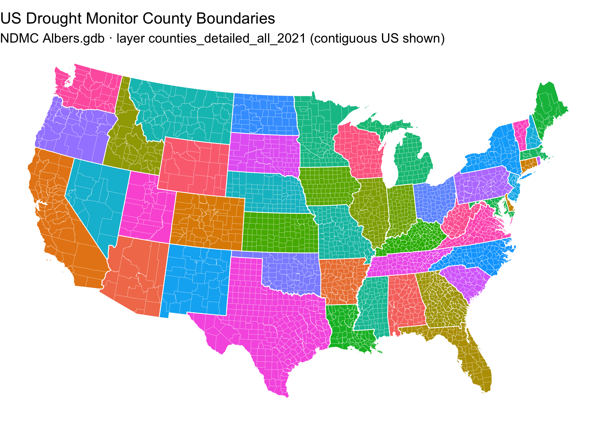

[](https://github.com/sustainable-fsa/ndmc-counties-albers)

This repository contains an archival copy of the **Albers.gdb.zip**
dataset, originally distributed by the National Drought Mitigation
Center (NDMC) at the University of Nebraska, Lincoln. The NDMC stewards
the US Drought Monitor, a weekly assessment of drought conditions in the
United States and outlying territories.

## Download Script

This is the script used to acquire the archived geodatabase. It is not
evaluated when this README is knit, so that knitting never overwrites
the archived artifact.

``` r
install.packages("curl")

## Download the NDMC Albers.gdb.zip file
curl::multi_download("https://droughtcenter.unl.edu/Outgoing/Albers.gdb.zip",
                     "Albers.gdb.zip")
```

## 📦 Dataset Overview

- **Title:** Albers.gdb
- **Source:** National Drought Mitigation Center (NDMC), University of
  Nebraska–Lincoln
- **Format:** ESRI File Geodatabase (.gdb), USA Contiguous Albers Equal
  Area Conic projection (ESRI:102003)
- **Original Distribution:**
  <https://droughtcenter.unl.edu/Outgoing/Albers.gdb.zip>
- **Distribution Type:** Public archival for research and historical
  purposes
- **Date of Archive:** 2025-06-06

## 📂 Contents

The zipped geodatabase contains ten county-boundary layers (all with a
2021 vintage in their names) reportedly used by the NDMC in producing
weekly US Drought Monitor county statistics and map products. This
repository provides:

- [`Albers.gdb.zip`](https://data.sustainable-fsa.com/ndmc-counties-albers/Albers.gdb.zip)
  – The original NDMC File Geodatabase, archived unmodified
- [`ndmc-counties-albers.R`](https://sustainable-fsa.com/ndmc-counties-albers/ndmc-counties-albers.R)
  – R script that downloads the geodatabase from the NDMC server

Layers in the geodatabase:

| Layer                            | Geometry          |
|----------------------------------|-------------------|
| `counties_detailed_all_2021`     | Multi Polygon     |
| `counties_detailed_stats_2021`   | Multi Polygon     |
| `counties_detailed_total_2021`   | Multi Polygon     |
| `counties_detailed_usvi_2021`    | Multi Polygon     |
| `counties_simp_all_2021`         | Multi Polygon     |
| `counties_simp_total_2021`       | Multi Polygon     |
| `counties_simp_total_2021_1`     | Multi Polygon     |
| `counties_simp_json_2021`        | Multi Polygon     |
| `counties_simp_usvi_2021`        | Multi Polygon     |
| `counties_simp_total_inner_2021` | Multi Line String |

The `detailed` layers carry full-resolution boundaries; the `simp`
layers are simplified variants. The NDMC has not published documentation
of the layers’ intended uses.

## 🧾 Field Descriptions

Fields of the primary layer, `counties_detailed_all_2021` (3,264
features covering all states and territories):

| Field Name | Description |
|----|----|
| `CountyFIPS` | A five-digit FIPS state and county code |
| `CountyName` | The county name |
| `StateFIPS` | A two-digit FIPS state code |
| `StateAbbr` | A two-letter USPS abbreviation for the state |
| `ISCONUS` | `YES`/`NO` — whether the county lies within the contiguous US |
| `ISTOTAL` | `YES`/`NO` flag; purpose not documented by the NDMC |
| `WKID` | Well-known ID of the layer’s coordinate reference system |
| `Shape_Length` | The polygon edge length in meters |
| `Shape_Area` | The polygon area in square meters |

## 🛠️ How to Use

1.  Unzip the `Albers.gdb.zip` file.
2.  Open the `Albers.gdb` geodatabase in a GIS software environment such
    as [QGIS](https://qgis.org) or [ArcGIS
    Pro](https://www.esri.com/en-us/arcgis/products/arcgis-pro/overview).
3.  Use the layer properties to explore attributes and spatial coverage.

------------------------------------------------------------------------

## 📍 Quick Start: Visualize the Albers.gdb county boundaries in R

This snippet shows how to read the `counties_detailed_all_2021` layer
directly from the archive and create a simple map using `sf` and
`ggplot2`.

``` r
# Load required libraries
library(sf)      # For spatial data
library(ggplot2) # For plotting
library(dplyr)   # For data manipulation

## Read the primary layer from the archived NDMC geodatabase
counties <-
  sf::read_sf("/vsizip//vsicurl/https://data.sustainable-fsa.com/ndmc-counties-albers/Albers.gdb.zip",
              layer = "counties_detailed_all_2021") |>
  dplyr::filter(ISCONUS == "YES")
```

    ## Warning in CPL_read_ogr(dsn, layer, query, as.character(options), quiet, : GDAL
    ## Message 1: organizePolygons() received a polygon with more than 100 parts.  The
    ## processing may be really slow.  You can skip the processing by setting
    ## METHOD=SKIP. Further messages of this type will be suppressed.

    ## Warning in CPL_read_ogr(dsn, layer, query, as.character(options), quiet, : GDAL
    ## Message 1: organizePolygons() received a polygon with more than 100 parts. The
    ## processing may be really slow.  You can skip the processing by setting
    ## METHOD=SKIP, or only make it analyze counter-clock wise parts by setting
    ## METHOD=ONLY_CCW if you can assume that the outline of holes is counter-clock
    ## wise defined. Further messages of this type will be suppressed.

``` r
states <-
  counties |>
  dplyr::group_by(StateFIPS) |>
  dplyr::summarise(.groups = "drop")

# Plot the map
ggplot() +
  geom_sf(data = counties,
          aes(fill = StateFIPS),
          color = "white",
          linewidth = 0.05,
          show.legend = FALSE) +
  geom_sf(data = states,
          fill = NA,
          color = "white",
          linewidth = 0.3) +
  labs(title = "US Drought Monitor County Boundaries",
       subtitle = "NDMC Albers.gdb · layer counties_detailed_all_2021 (contiguous US shown)") +
  theme_void()
```



------------------------------------------------------------------------

## 📌 Background

The National Drought Mitigation Center produces the weekly [US Drought
Monitor](https://droughtmonitor.unl.edu) and, under contract to the USDA
Office of the Chief Economist, performs the geospatial county
eligibility determinations for FSA’s Livestock Forage Disaster Program
(LFP). The `Albers.gdb` geodatabase, distributed from the NDMC’s public
server, is reportedly the county boundary layer the NDMC uses to produce
USDM county statistics and map products.

The provenance of these boundaries matters: in response to a FOIA
inquiry (documented in the
[`fsa-lfp-counties`](https://sustainable-fsa.com/fsa-lfp-counties/)
archive), the NDMC described its county layer as originating from an
ESRI dataset obtained around 2008 and essentially unchanged since — even
as the US Census has recorded hundreds of county boundary corrections
and changes over the same period. Because LFP eligibility turns on
whether qualifying drought touches *any area of a county*, the boundary
layer used in that intersection is consequential to program
administration. This archive preserves the geodatabase as distributed,
so those determinations can be independently reproduced and audited.

## 📝 Citation

If you use this data in published work, please cite:

> National Drought Mitigation Center. *NDMC Albers.gdb County Boundary
> Dataset*. Curated and archived by R. Kyle Bocinsky, Montana Climate
> Office, University of Montana. Sustainable FSA project. Accessed
> YYYY-MM-DD. <https://sustainable-fsa.com/ndmc-counties-albers/>

Machine-readable metadata are in [`CITATION.cff`](CITATION.cff);
GitHub’s **Cite this repository** button (top right of the repo page)
renders it as APA or BibTeX.

**Acknowledgment**: This work is part of the [*Enhancing Sustainable
Disaster Relief in FSA
Programs*](https://www.ars.usda.gov/research/project/?accnNo=444612)
project, supported by the USDA Office of the Chief Economist, Office of
Energy and Environmental Policy, and the USDA Climate Hubs.

## 📄 License

Data in the `Albers.gdb.zip` archive were produced and publicly
distributed by the National Drought Mitigation Center at the University
of Nebraska–Lincoln. Unlike works of the US federal government, they are
not automatically in the public domain; they are redistributed here,
unmodified, for research, transparency, and archival purposes, with
attribution to the NDMC. If you reuse the data, please credit the
National Drought Mitigation Center.

> No warranty is provided. Use at your own risk.

The [`ndmc-counties-albers.R`](ndmc-counties-albers.R) script is
copyright R. Kyle Bocinsky, and is released under the [MIT
License](LICENSE).

## ⚠️ Disclaimer

This dataset is archived for reference and research use. It may not
reflect current county boundaries and should not be used for official
program administration. Consult the NDMC or USDA for current data.

## 👏 Acknowledgment

This work is part of the [*Enhancing Sustainable Disaster Relief in FSA
Programs: Non-stationarity at the Intersection of Normal Grazing Periods
and US Drought
Assessment*](https://www.ars.usda.gov/research/project/?accnNo=444612)
project. It is supported by US Department of Agriculture Office of the
Chief Economist (OCE), Office of Energy and Environmental Policy (OEEP)
funds passed through to Research, Education, and Economics mission area.
We also acknowledge and appreciate the assistance of the USDA Climate
Hubs in securing these data.

## ✉️ Contact

Please contact Kyle Bocinsky (<kyle.bocinsky@umontana.edu>) with any
questions.
